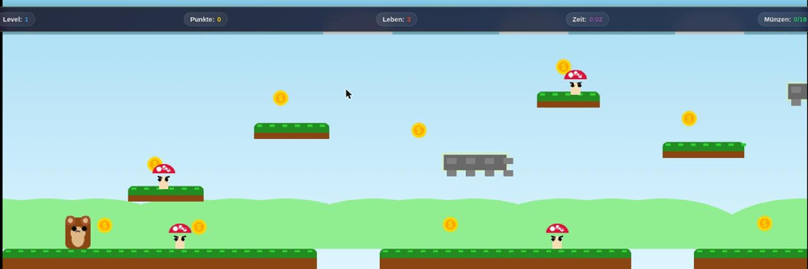
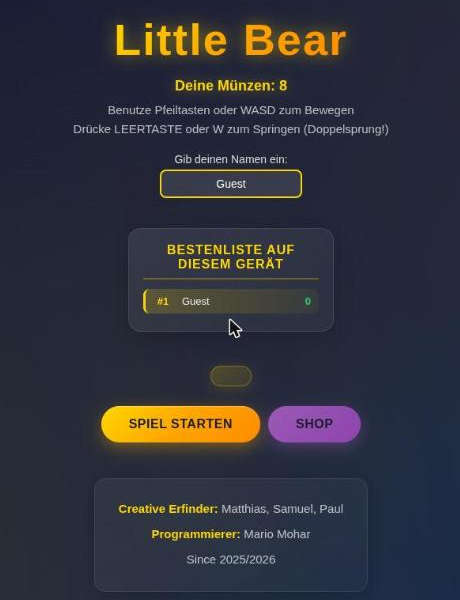

# Little Bear

[](https://codecov.io/gh/Mario-Mohar/little-bear-game)

A browser platformer: run, double jump, collect coins, avoid the mushrooms.
Levels are generated, so it keeps going.

**▶ [Play it here](https://mario-mohar.github.io/little-bear-game/)** — no
account, nothing to install.

**[English](#english) · [Deutsch](#deutsch)**

<p align="center">
  
</p>

<p align="center">
  
</p>

<p align="center"><sub>Screenshots from the static version, the one the link above serves. · Screenshots aus der statischen Fassung, die der Link oben ausliefert.</sub></p>

---

# English

## Two ways to run it

**As a static page**, which is what the link above serves. Everything that
matters works: the game, the shop with 9 skins and 26 accessories, coins, and a
high score list kept in your own browser. No account, no server, nothing leaves
your machine.

**With the server**, which adds what needs shared state: accounts, a global
leaderboard split by platform, friends, challenges and achievements. That half
needs Node, PostgreSQL and a place to run.

The client notices by itself which of the two it is in. Without a backend it
switches to guest mode, shows the local high score list instead of the global
one, and hides the buttons that would only produce an error.

## Playing

Arrow keys or WASD to move, space or W to jump. Pressing jump again in mid-air
gives you a second jump. You have three lives, a timer, and coins to pick up;
coins buy skins and accessories in the shop.

As a guest you keep 25% of the coins. That is not a limitation of the static
version — the same rule applies on the server, where an account gives you the
other 75% and a place in the global list.

## Running the full version

```bash
npm install
cp .env.example .env      # fill in DATABASE_URL and JWT_SECRET
npm start
```

Needs Node 18+ and a PostgreSQL database. `railway.json` is included; the app
was built to run there.

Admin rights belong to an account, not to a shared password. Register normally,
then grant them from a shell on the server:

```bash
npm run make-admin -- yourname      # grant
npm run make-admin -- --list        # who has them
npm run make-admin -- --revoke name # take them away
```

There is deliberately no route for this — it needs a shell and the database
credentials. Note that `is_admin` travels in the JWT, which lives seven days: a
new admin has to sign in again, and a revoked one keeps the rights in an
already-issued token until it expires.

## Serving just the game

```bash
cd public
python3 -m http.server 8000
# then open http://localhost:8000
```

That is exactly what GitHub Pages does with this repository.

## Credits

Game idea and design: Matthias, Samuel and Paul. Code: Mario Mohar.

## Licence

MIT, see [LICENSE](LICENSE).

---

# Deutsch

## Zwei Arten, es zu starten

**Als statische Seite**, so wie der Link oben. Alles Wesentliche funktioniert:
das Spiel, der Shop mit 9 Skins und 26 Accessoires, Münzen, und eine
Bestenliste, die im eigenen Browser bleibt. Kein Konto, kein Server, nichts
verlässt den Rechner.

**Mit Server**, das ergänzt alles, was gemeinsamen Zustand braucht: Konten, eine
globale Rangliste getrennt nach Plattform, Freunde, Challenges und Erfolge.
Dieser Teil braucht Node, PostgreSQL und einen Ort zum Laufen.

Der Client merkt selbst, in welchem der beiden Fälle er steckt. Ohne Backend
schaltet er in den Gastmodus, zeigt die lokale Bestenliste statt der globalen
und blendet die Knöpfe aus, die nur eine Fehlermeldung bringen würden.

## Spielen

Pfeiltasten oder WASD zum Bewegen, Leertaste oder W zum Springen. Ein zweiter
Druck in der Luft gibt einen Doppelsprung. Du hast drei Leben, eine Zeit und
Münzen zum Einsammeln; von den Münzen kaufst du im Shop Skins und Accessoires.

Als Gast behältst du 25 % der Münzen. Das ist keine Einschränkung der statischen
Fassung — dieselbe Regel gilt auf dem Server, wo ein Konto die restlichen 75 %
und einen Platz in der globalen Liste bringt.

## Vollversion starten

```bash
npm install
cp .env.example .env      # DATABASE_URL und JWT_SECRET eintragen
npm start
```

Braucht Node 18+ und eine PostgreSQL-Datenbank. Die `railway.json` liegt bei,
dort war die Anwendung zum Laufen gedacht.

Adminrechte hängen am Konto, nicht an einem geteilten Passwort. Normal
registrieren, dann auf dem Server in einer Shell vergeben:

```bash
npm run make-admin -- deinname       # geben
npm run make-admin -- --list         # zeigen, wer sie hat
npm run make-admin -- --revoke name  # nehmen
```

Dafür gibt es bewusst keine Route — es braucht eine Shell und die
Datenbank-Zugangsdaten. `is_admin` reist im JWT mit, und das lebt sieben Tage:
wer gerade Admin wurde, muss sich neu anmelden, und wem die Rechte genommen
wurden, behält sie in einem bereits ausgestellten Token bis zum Ablauf.

## Nur das Spiel ausliefern

```bash
cd public
python3 -m http.server 8000
# dann http://localhost:8000 aufrufen
```

Genau das macht GitHub Pages mit diesem Repository.

## Mitwirkende

Spielidee und Gestaltung: Matthias, Samuel und Paul. Code: Mario Mohar.

## Lizenz

MIT, siehe [LICENSE](LICENSE).

## Contributing

Bug reports, feature requests and pull requests are all welcome — finding
something that is broken and writing it down is a real contribution, and the
most useful one.

**[CONTRIBUTING.md](CONTRIBUTING.md)** has the details: what makes a report
useful, how to send a fix through a fork, and what happens after you submit.
